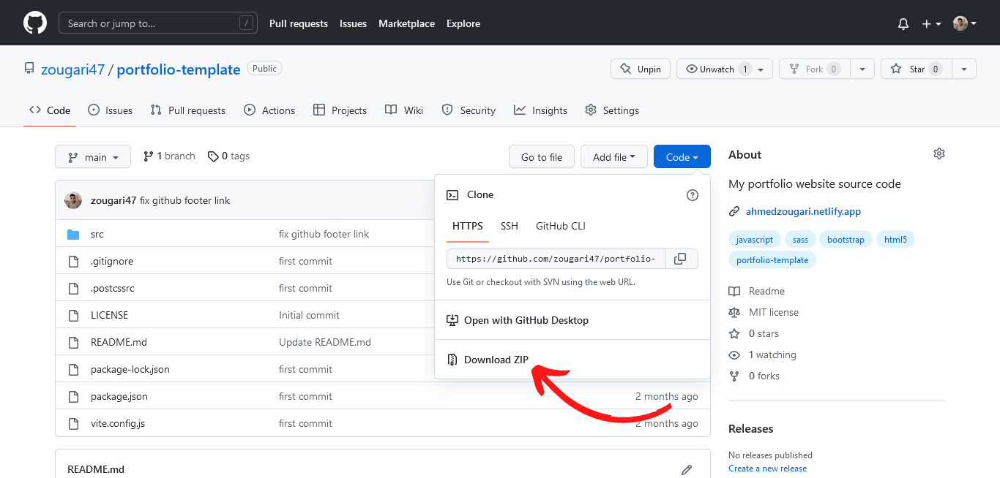

# Portfolio Template - Guide

## Table of contents

- [Portfolio Template - Guide](#portfolio-template---guide)
  - [Table of contents](#table-of-contents)
  - [Requirements](#requirements)
  - [Set Up The Environment](#set-up-the-environment)
  - [Customize Style](#customize-style)
    - [Colors](#colors)
    - [Fonts](#fonts)
    - [Breakpoints](#breakpoints)
    - [Icons](#icons)
  - [Header](#header)
  - [Hero](#hero)
    - [Hello Section](#hello-section)
    - [Image](#image)
  - [About](#about)
  - [Projects](#projects)
  - [Contact](#contact)
  - [Deploy](#deploy)

## Requirements

Before going forward you must have **Node js** installed on your machine.  
Go to the link below for installation if you don't have installed yet.

- [Node js](https://nodejs.org/en/download)

## Set Up The Environment

1. download the repository
   

2. unzip folder and open it with [VS Code](https://code.visualstudio.com/)
3. Open terminal `Ctrl`+`'` & install dependencies by running `npm install` command
4. Run the command `npm run dev` to start live server
5. `Ctrl` + click on `http://localhost:3000/`
6. congratulation 🎉 you have setup the environment successfully

## Customize Style

I tried to make it more customizable so you can adjust it to your own need 🏹

### Colors

I follow the 60-30-10 rule. So if you don't like the palettes and you want to add yours, you will need two palettes 🎨 (light/dark). and change them in two files.

1️⃣ First file

Go to `/src/sass/base/_varaibles.scss` and add your colors in **HEX** format like below 👇

```scss
$theme-colors: (
  'primary': #ffffff,
  'secondary': #444f5a,
  'accent': #0564bd
);
```

2️⃣ Second file

Go to `/src/js/themes.js`
and change the constant `themes` like below 👇

```js
const themes = {
  light: {
    primary: '#ffffff',
    secondary: '#444f5a',
    accent: '#0564bd',
    primaryRGB: '255, 255, 255',
    secondaryRGB: '68, 79, 90'
  },

  dark: {
    primary: '#22222b',
    secondary: '#a2a1a6',
    accent: '#0564bd',
    primaryRGB: '34, 34, 43',
    secondaryRGB: '162,161,166'
  }
};
```

The `primaryRGB` and `secondaryRGB` are values in the **RGB** color format. The purpose of it is to use the color variable with custom opacity like this

```css
box-shadow: 0 3px 6px rgba(var(--bs-secondary-rgb), 0.2);
```

I could use this [trick](https://twitter.com/zougari47/status/1538520749312552960) but I prefer sticking with the Bootstrap system.  
If you want to convert from **HEX** to **RGB** check this [tweet](https://twitter.com/zougari47/status/1543033189337337861).

### Fonts

I used two fonts [Finger Paint](https://fonts.google.com/specimen/Finger+Paint?query=finger) for headings and [Raleway](https://fonts.google.com/specimen/Raleway?query=Raleway) for body. (⚠ I used them locally `src/fonts`)

If you're not satisfied with these fonts, go to `/src/sass/base/_typography.scss` ,and clean all the code then import your fonts.

Then go `/src/sass/base/_mixin.scss` and change the value of `font-primary` and `font-secondary` @mixin.

### Breakpoints

Again, I prefer Bootstrap's breakpoints

```scss
$grid-breakpoints: (
  xs: 0,
  sm: 576px,
  md: 768px,
  lg: 992px,
  xl: 1200px,
  xxl: 1400px
);
```

You can change it by writing this snippet above with your preferred values in `src/sass/base/_variables.scss`

But it is recommended not to change it.

### Icons

You can change the social media icons. This project uses [bootstrap-icons](https://icons.getbootstrap.com/) library.

## Header

There is nothing to change here besides your logo. If you want the logo to change color while toggling between dark/light mode, paste the **SVG** code and make sure it has the attribute fill with currentcolor value `fill="currentcolor"`. Otherwise, import it with img tag.

## Hero

### Hello Section

To change the value of the typed effect go to `/src/js/typed.js` and put your headlines in the string array.

📌 If you want the typed effect to keep looping, uncomment `loop:true` in the options

### Image

I had to add something special in the Portfolio and I came up with this hover effect using [Curtain js](https://www.curtainsjs.com) library.

If you want to remove it delete this line from `src/js/main.js`

```js
import './curtain';
```

And go to `/src/sass/components/_hero.scss` and change `.curtain img` to this value

```css
.curtain img {
  display: block;
  height: auto;
  width: 100%;
  border-radius: 39% 61% 71% 29% / 38% 29% 71% 62%;
}
```

Otherwise just change the image src.

## About

Talk about yourself in three paragraphs in the about section. For the skills it's better to not go over 12.

If you want to add a skill logo which doesn't exist in `/src/img/stack-icons` :

- Go to [icon-icons](https://icon-icons.com/) website or Any alternative and download it.
- Move it to `/src/img/stack-icons` folder.
- Change it in HTML like below

```html
<div class="col-6 col-md-4">
  
  <span>your-skill</span>
</div>
```

## Projects

⚠ The project's images must be the same width and height to not break the design because I'm using responsive images.

```css
img {
  display: block;
  width: 100%;
  height: auto;
}
```

You can achieve that by editing tools like [Figma](https://figma.com) or any alternative.

The project card HTML should look like below.

```html
<div>
  <div class="project" data-aos="flip-up" data-aos-duration="1000">
    
    <div class="details">
      <div
        class="position-absolute top-50 start-50 translate-middle bg-accen w-100"
      >
        <p class="text-center">describe your project here</p>
        <div class="links_project">
          <a
            href="link-of-source-code"
            target="_blank"
            rel="noopener noreferrer"
            title="source code"
          >
            <i class="bi bi-github"></i>
          </a>
          <a
            href="link-for-live-demo"
            target="_blank"
            rel="noopener noreferrer"
            title="live demo"
          >
            <i class="bi bi-eye-fill"></i>
          </a>
        </div>
      </div>
      <div class="technology">
        <div class="row">
          <div class="col d-flex justify-content-center">
            
          </div>
          <div class="col d-flex justify-content-center">
            
          </div>
          <div class="col d-flex justify-content-center">
            
          </div>
          <div class="col d-flex justify-content-center">
            
          </div>
        </div>
      </div>
    </div>
  </div>
</div>
```

## Contact

If you want the contact form to work. follow this step 👇:

- Go to [FormBold](https://formbold.com)
- Create an account and create a form
- Copy the URL of the form
- Go to `/src/js/contact.js` and past it in `API_URL` constant like so
  ```js
  const API_URL = 'https://formbold.com/s/id';
  ```

## Deploy

After you are done editing:

- Stop dev mode with `Ctrl`+`C`
- Run command `npm run build`
- It will create a **dist** folder, This folder is what you should deploy
